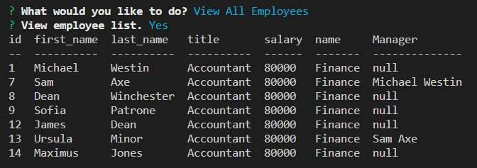

# Employee_Tracker

---

## Description

MySQL Employee Tracker Project is a command line program that allows the user to track, add, and update an employee list in a SQL database.

\

---

## Installation

In order to use the employee tracker:

1. Make sure you have MySQL installed.
2. Use Git Bash or the VS terminal to install the needed npm node packages:
   - Run 'npm i' to pull down the npm package manager.
   - Run 'npm init -y' to install package.json.
   - Run 'npm install inquirer' to install the inquirer package that provides the needed prompt coding.
3. Open the main folder in Git Bash or the VS terminal.
4. Run the schema files to create the database and tables. Then use the seed file to load some initial sample data.
5. Run 'npm start' to being the employee tracker.

---

## Usage

This program can be used with permission to generate a SQL employee tracker.

---

## License

---

## Contact

If you have any questions, please contact me at:\
✉️[Email](mailto:hrkoren@gmail.com)\
📂[GitHub](https://github.com/hrkoren)
